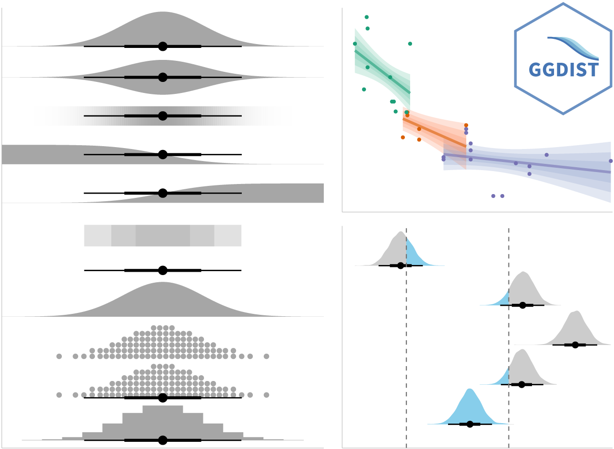
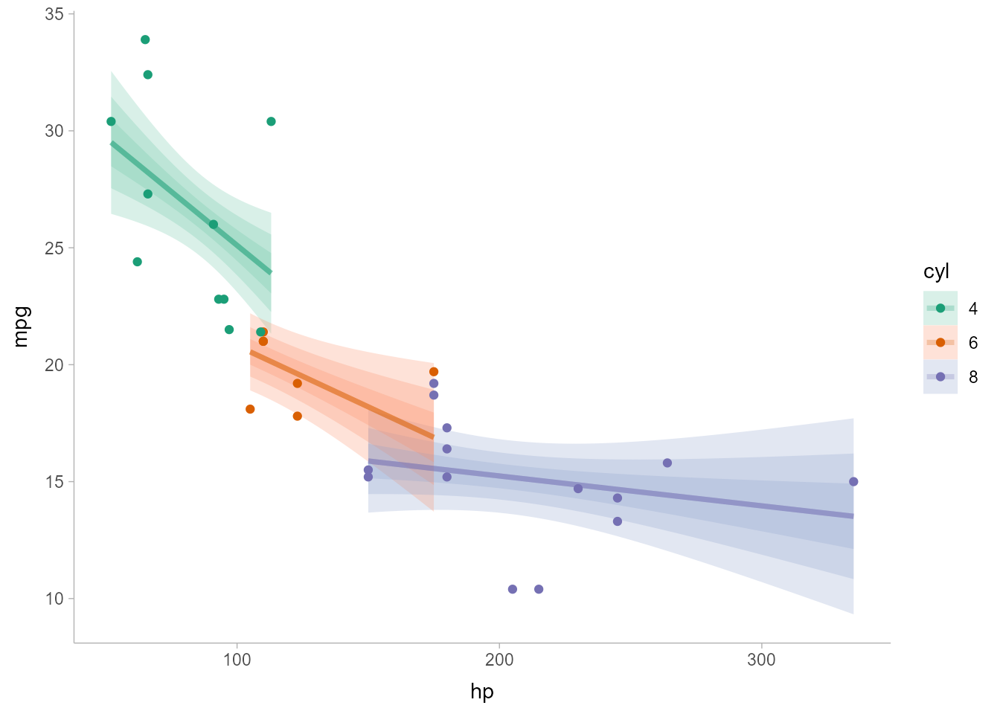

# ggdist: Visualizations of distributions and uncertainty

[](https://github.com/mjskay/ggdist/actions)
[](https://codecov.io/github/mjskay/ggdist?branch=master)
[](https://cran.r-project.org/package=ggdist)

[](https://doi.org/10.5281/zenodo.3879621)



`ggdist` is an R package that provides a flexible set of `ggplot2` geoms
and stats designed especially for visualizing distributions and
uncertainty. It is designed for both frequentist and Bayesian
uncertainty visualization, taking the view that uncertainty
visualization can be unified through the perspective of distribution
visualization: for frequentist models, one visualizes confidence
distributions or bootstrap distributions (see
`vignette("freq-uncertainty-vis")`); for Bayesian models, one visualizes
probability distributions (see `vignette("tidybayes", package =
"tidybayes")`).

The `geom_slabinterval()` / `stat_slabinterval()` /
`stat_dist_slabinterval()` family (see `vignette("slabinterval")`)
includes point summaries and intervals, eye plots, half-eye plots, CCDF
bar plots, gradient plots, dotplots, and histograms:


The `geom_lineribbon()` / `stat_lineribbon()` / `stat_dist_lineribbon()`
family makes it easy to visualize fit lines with an arbitrary number of
uncertainty bands:

<!-- -->

All geoms in `ggdist` also have `stat_dist_` counterparts designed for
visualizing analytical distributions, which is particularly useful when
visualizing uncertainty in frequentist models (see
`vignette("freq-uncertainty-vis")`) or when visualizing priors in a
Bayesian analysis.

The `ggdist` geoms and stats also form a core part of the
[tidybayes](http://mjskay.github.io/tidybayes/) package (in fact, they
originally were part of `tidybayes`). For examples of the use of
`ggdist` geoms and stats for visualizing uncertainty in Bayesian models,
see the vignettes in tidybayes, such as `vignette("tidybayes", package =
"tidybayes")` or `vignette("tidy-brms", package = "tidybayes")`.

## Installation

Once on CRAN, you can install the currently-released version from CRAN
with this R command:

``` r
install.packages("ggdist")
```

Alternatively, you can install the latest development version from
GitHub with these R commands:

``` r
install.packages("devtools")
devtools::install_github("mjskay/ggdist")
```

## Feedback, issues, and contributions

I welcome feedback, suggestions, issues, and contributions\! Contact me
at <mjskay@umich.edu>. If you have found a bug, please file it
[here](https://github.com/mjskay/ggdist/issues/new) with minimal code to
reproduce the issue. Pull requests should be filed against the
[`dev`](https://github.com/mjskay/ggdist/tree/dev) branch.

## Citing `ggdist`

Matthew Kay (2020). *ggdist: Visualizations of Distributions and
Uncertainty*. R package version 2.1.0,
<https://mjskay.github.io/ggdist/>. DOI:
[10.5281/zenodo.3879620](https://doi.org/10.5281/zenodo.3879620).
